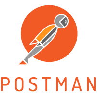

# Assignment Task - Intern@DataGorkr

>  [Section 1](#1-environment-setup-and-data-loading) | [Section 2](#2-working-with-data-and-sql) | [Section 3](#3-restful-api---python-flask-and-sql-alchemy) | [Endpoints](#endpoints) | [API-Documentation](#api-documentation) | [Directory Tree](#directory-tree) | [TechStack](#tech-stack) | [Task Details](#task-details)

## 1. Environment setup and data loading.

Refer `Section1.txt` file for the desired deliverables.

Remarks:
* It is observed that appending the following in `my.cnf` of [MySQL installation](https://dev.mysql.com/doc/mysql-installation-excerpt/5.7/en/) will enable smooth flow of the delivered solution. (On Ubuntu 20.x found at `/etc/mysql/my.cnf`).

```
[mysqld]
secure-file-priv=""
sql-mode=""
```
## 2. Working with data and SQL

Refer `Section2.txt` file for the desired deliverables.

## 3. RESTful API - Python Flask and SQL Alchemy.

### Quickstart with `Pipenv`:


>Installation:

_MacOS_:

```
$ brew install pipenv
```
_Debian_:
```bash
$ sudo apt install pipenv
```
_Windows:_

* Run Windows Power Shell as Administrator.
* Run the following command in Power Shell.
  
  ```powershell
  pip install pipenv
  ```
* Excute the following command to set the `path`. (Replace <user_name> with your user name)

``` powershell
set PATH=%PATH%;set PATH=%PATH%;'c:\users\<user_name>\appdata\local\programs\python\python36-32\Scripts'
```

Issues? [Try Official Documentation.](https://pypi.org/project/pipenv/)


> Usage:
``` bash
# Activate venv
$ pipenv shell

# Install dependencies
$ pipenv install

# Run Server (http://localhst:5000)
python app.py
```
> Known issues with python3.x:

It is observed that `mysqlclient` will fail to install through `pipenv` when using `python3.x`. This could be resolved using the following:

```
$ sudo apt-get install python3.7-dev libmysqlclient-dev libssl-dev
$ pipenv install
```

### API Documentation

The following RESTful API implements CURD operations on [`Northwind`](https://documenter.getpostman.com/view/12122001/T1DnidZm?version=latest) dataset. A detailed documentation is avaiable [here](https://documenter.getpostman.com/view/12122001/T1DnidZm).


### Endpoints

* GET     products
* GET     product/:ProductID
* GET     customers  
* GET     customer/:CustomerID
* GET     orderhistory/:CustomerID

* POST    product/add
* POST    customer/add  
  

* PUT     product/update/:ProductID
* PUT     customer/update/:CustomerID 
  
* DELETE  product/remove/:ProductID
* DELETE  customer/remove/:CustomerID

### Directory Tree:
```
.
├── app.py
├── extras
│   ├── logos
...
│   ├── mysql.sql
│   ├── northwind-er-relationship.png
│   ├── northwind files
...
│   ├── taskdetails.docx
│   └── test.json
├── Pipfile
├── Pipfile.lock
├── README.md
├── Sec1.txt
└── Sec2.txt

3 directories, 26 files
```
### Tech Stack:

  |  |  |  

### Task Details:

Task details can be found at `./extras/taskdetails.docx`. 